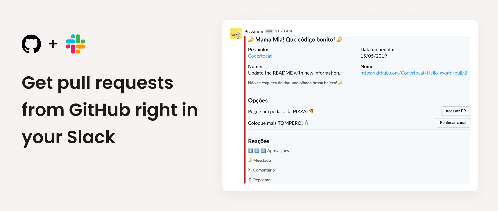

<p align="center">
  
</p>
<h1 align="center">
  Pizzaiolo
</h1>


## Summary

- [👉 What is this?](#👉-what-is-this)
- [🤌 Why?](#🤌-why)
- [🍕 Demo](#🍕-demo)
- [🚀 Installation](#🚀-installation)
- [🛫 Deploying](#🛫-deploying)
- [📫 Contributing](#📫-contributing)

## 👉 What is this?

This project is a simple **SlackBot** that integrates with **GitHub**.

Every time that a PULL REQUEST is created, updated, finished, commented or approved, this boot will send a message in a Slack Channel.

## 🤌 Why?

In our team we work with a code-review step.

In this moment, when a developer finish the code, it's necessary that another one review it.

But, how to mantain all PRs and their respectives status stored in one place?

Thats is Pizzaiolo!

<p align="center">
  
</p>

## 🍕 Demo

https://pizzaiolo.site

## 🚀 Installation

You can install using this commands

```bash
git clone git@github.com:Joao208/frontend-pizzaiolo.git

cd frontend-pizzaiolo

yarn

yarn build

yarn start
```

## 🛫 Deploying

You can deploy your own Vercel instance of this project.

[](https://vercel.com/new/git/external?repository-url=https://github.com/Joao208/frontend-pizzaiolo)

## 📫 Contributing

Please take a look on the [contributing](docs/CONTRIBUTING.md) session.
